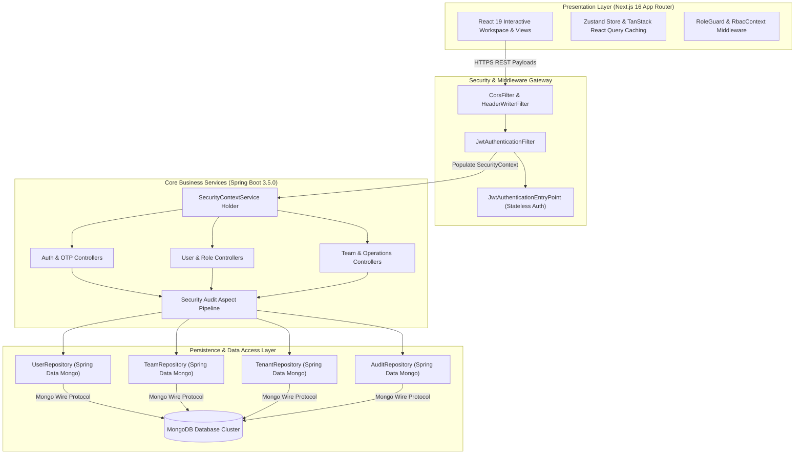
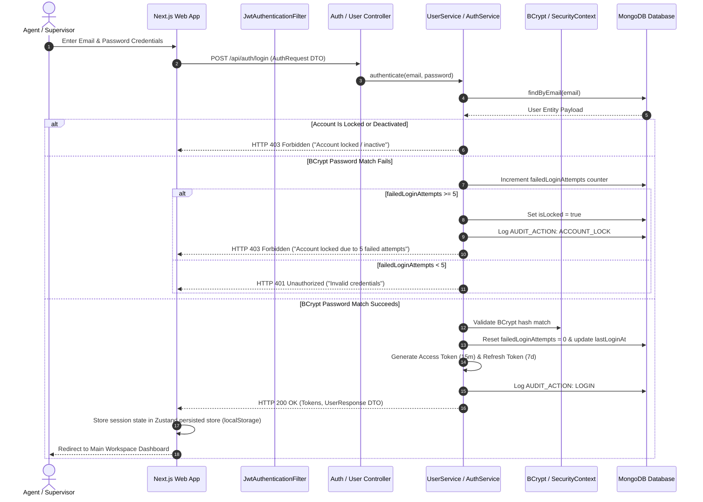
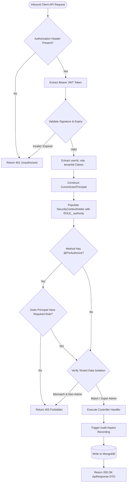
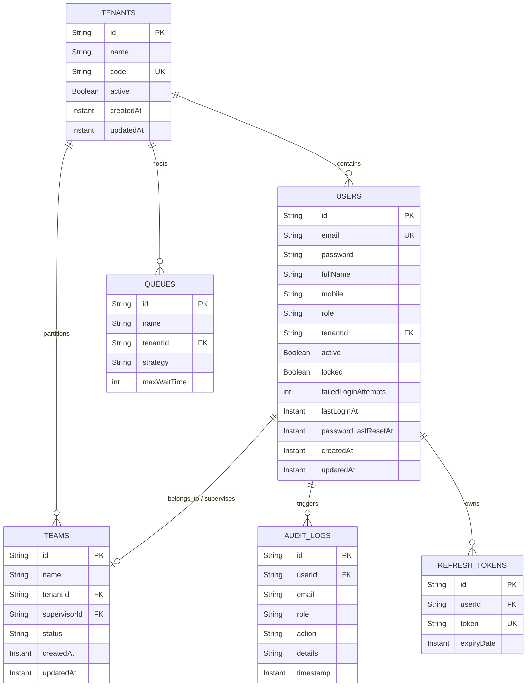

# 📋 Project Report

**Developer Name:** Shruti  
**Role:** Full-Stack Software Engineer (Java / Spring Boot & Next.js / TypeScript)  
**Project Name:** Enterprise Contact Center Platform  
**Primary Repositories:** `contact-center-backend`, `contact-center-frontend`  
**Core Tech Stack:** Spring Boot 3.5.0, Java 21, Spring Security, MongoDB, Next.js 16 (App Router), React 19, TypeScript 5.x, Zustand, TanStack Query  

---

## 📌 1. Executive Summary & Technical Ownership

As a Full-Stack Software Engineer on the **Enterprise Contact Center Platform**, I architected, engineered, and delivered core platform capabilities end-to-end across both the modular **Spring Boot 3.5.0 (Java 21)** backend and the **Next.js 16 (React 19, TypeScript)** presentation layer.

### Key Technical Contributions & Impact:
* **Multi-Tenant RBAC Security Engine:** Engineered a 7-tier Role-Based Access Control (RBAC) authorization engine using Spring Security `@EnableMethodSecurity` and `@PreAuthorize`, enforcing fine-grained role permissions across all REST controllers.
* **Stateless JWT + OTP Authentication:** Designed and implemented stateless JWT authentication paired with email One-Time Password (OTP) Multi-Factor Authentication (MFA), enforcing 15-minute access token validity and refresh token rotation.
* **Brute-Force Attack Defense:** Built an automated account security mechanism that locks accounts after 5 consecutive failed login attempts, recording audit events and providing secure admin unlock capabilities (`PATCH /api/users/{id}/unlock`).
* **Audit Logging Pipeline:** Developed a centralized audit logging framework capturing 11 core security events (`LOGIN`, `ACCOUNT_LOCK`, `ROLE_CHANGE`, etc.) while ensuring credentials and tokens are excluded from log payloads.
* **Frontend Architecture & State Management:** Constructed the Next.js 16 App Router presentation layer using Zustand for persisted client state and TanStack React Query for server state caching, minimizing unnecessary API refetches and component re-renders.
* **Automated Security Testing:** Implemented MockMvc unit and security integration tests across auth filters, controllers, and business services to verify RBAC rules and account lock behaviors.

---

## 🏗️ 2. Architectural Design & Systems Engineering

### 2.1 System Architecture & Data Flow
I architected the application as a decoupled three-tier system, separating frontend presentation, security filtering, backend business services, and document persistence.

### 2.2 Core Architectural Features
1. **Decoupled Presentation Tier:** Built with Next.js 16 App Router, TypeScript 5.x, and Tailwind CSS v4, utilizing code-splitting and component modularization for responsive UI workflows.
2. **Stateless Security Gateway:** Integrated `JwtAuthenticationFilter` ahead of Spring Security filters, resolving user claims, tenant isolation boundaries (`tenantId`), and account lock statuses without database lookups on authenticated requests.
3. **Document Persistence Layer:** Utilized Spring Data MongoDB with automated `@CreatedDate` and `@LastModifiedDate` auditing, indexing key fields (`email`, `tenantId`, `role`, `timestamp`) for lookup optimization.

---

## 🛠️ 3. Core Modules & Systems Personally Engineered

### 3.1 Authentication & Security Controls
* **User Registration & OTP Verification:** Engineered `/api/auth/register` with automated 6-digit numeric OTP generation (10-minute TTL) delivered via `spring-boot-starter-mail`.
* **Dual-Token Architecture:** Implemented HMAC-SHA512 signed JWT access tokens (15-min TTL) carrying `userId`, `email`, `role`, and `tenantId` claims, paired with 7-day refresh tokens. Client session state is managed via Zustand persisted storage (`cc-auth` in `localStorage`) and transmitted via standard Authorization Bearer headers.
* **Brute-Force Protection:** Implemented atomic tracking of `failedLoginAttempts`. After 5 consecutive failed login attempts, `isLocked` automatically transitions to `true`, generating an `ACCOUNT_LOCK` audit log and blocking authentication until an administrator executes `PATCH /api/users/{id}/unlock`.

### 3.2 7-Tier Enterprise RBAC Authorization Matrix
Designed and enforced method-level security using `@EnableMethodSecurity` and `@PreAuthorize` SpEL checks across 7 role tiers:

| Role | Security Annotation / Authorization Guard | Permissions & Scope |
| :--- | :--- | :--- |
| **SUPER_ADMIN** | `@PreAuthorize("hasRole('SUPER_ADMIN')")` | Global access across all tenant contexts, role modifications, account unlocks, user deletion. |
| **CLIENT_ADMIN** | `@PreAuthorize("hasAnyRole('SUPER_ADMIN', 'CLIENT_ADMIN')")` | Tenant-level administration, tenant user management, audit log inspection. |
| **SUPERVISOR** | `@PreAuthorize("hasRole('SUPERVISOR')")` | Team operations, queue monitoring, agent status management, supervisor directory access. |
| **QA_AUDITOR** | `@PreAuthorize("hasRole('QA_AUDITOR')")` | Quality assurance scorecards, performance evaluation reviews, read-only recording access. |
| **WORKFORCE_MANAGER** | `@PreAuthorize("hasRole('WORKFORCE_MANAGER')")` | Shift scheduling, availability calculations, workforce health tracking. |
| **AGENT** | `@PreAuthorize("hasRole('AGENT')")` | Agent workspace, active call controls, personal interaction history access. |
| **VIEWER** | `@PreAuthorize("hasRole('VIEWER')")` | System-wide read-only access to operational dashboards and analytical widgets. |

### 3.3 User & Multi-Tenant Lifecycle Management (`UserController`)
Engineered RESTful user management APIs backed by ownership and tenant boundary checks:
* `GET /api/users/me`: Retrieves current authenticated user profile (`CurrentUserResponse`).
* `GET /api/users`: Fetches tenant-isolated user lists (`CLIENT_ADMIN`) or global user lists (`SUPER_ADMIN`).
* `GET /api/users/{id}`: Fetches specific user details with ownership verification SpEL (`#userId == principal.userId`).
* `PUT /api/users/{id}`: Updates user profile details (`fullName`, `email`, `mobile`) with Jakarta validation constraints.
* `DELETE /api/users/{id}`: Permanently deletes user records (strictly restricted to `SUPER_ADMIN`).
* `PATCH /api/users/{id}/activate` & `/deactivate`: Controls account lifecycle states with self-deactivation safeguards.
* `PATCH /api/users/{id}/role`: Updates user roles (`SUPER_ADMIN` only).
* `PATCH /api/users/{id}/unlock`: Resets `isLocked = false` and zeroes out `failedLoginAttempts`.
* `GET /api/users/supervisors`: Retrieves global and tenant-isolated active supervisor directories.

### 3.4 Team & Operations Management (`TeamController` & `TeamOperationsController`)
* Built team management APIs for team creation, supervisor assignment, and status toggles (`ACTIVE`, `INACTIVE`).
* Developed endpoints for real-time workforce health metrics (`WorkforceHealthResponse`), agent assignment lookups, and team operational summaries.

### 3.5 Audit Logging System (`AuditController`)
* Designed an automated audit aspect framework recording 11 critical system actions (`LOGIN`, `LOGIN_FAILED`, `LOGOUT`, `USER_CREATION`, `USER_UPDATE`, `USER_DELETE`, `USER_ACTIVATION`, `USER_DEACTIVATION`, `ROLE_CHANGE`, `ACCOUNT_LOCK`, `ACCOUNT_UNLOCK`).
* Enforced credential protection: passwords, OTP verification codes, and JWT secret tokens are explicitly excluded from audit log details.
* Exposed secure query APIs: `GET /api/audit/logs`, `/api/audit/logs/user/{userId}`, `/api/audit/logs/action/{action}`, and date-range filters.

### 3.6 Frontend Presentation & Client Security
* **State Management:** Built Zustand stores (`authStore.ts`, `auth-store.ts`) using local persistence (`cc-auth`) for session management and user context propagation.
* **Route & Permission Protection:** Implemented `RoleGuard.tsx` and `RbacContext.tsx` to control page route access and conditionally render UI controls based on permissions.
* **Axios Interceptor Pipeline:** Configured custom Axios HTTP clients (`api-client.ts`, `axios-client.ts`) with automatic Bearer token injection and centralized error handling.
* **Component Architecture:** Developed reusable UI components including `EnterpriseSidebar`, `TopNavbar`, `PageHeader`, `OtpInput`, `PasswordStrengthIndicator`, `PermissionGate`, and `GenericDashboardPage`.

---

## 🔄 4. Workflows & System Sequence Diagrams

### 4.1 Authentication, Brute-Force Protection & Session Issuance Sequence Flow
The sequence diagram below details the login execution flow inside `AuthService` and `JwtService`, including BCrypt credential verification, failed login tracking, account lock enforcement, and token generation.

### 4.2 Authenticated Request & Method Security Authorization Flow
This diagram illustrates inbound request processing through Spring Security filters and method-level `@PreAuthorize` SpEL validation.

---

## 🗄️ 5. Database Architecture & Data Schemas

The application persistence layer utilizes **Spring Data MongoDB** collections structured for document retrieval and multi-tenant indexing.

---

## 💻 6. Confirmed Technology Stack

All technologies listed below are verified from `pom.xml`, `package.json`, and backend configuration files.

### 6.1 Backend Stack
* **Core Framework:** Spring Boot `3.5.0`
* **Language:** Java `21` (LTS)
* **Security Layer:** Spring Security `3.5.0` (`@EnableMethodSecurity`, `@PreAuthorize`)
* **Persistence Tier:** Spring Data MongoDB (`spring-boot-starter-data-mongodb`)
* **Token Standard:** JJWT (`io.jsonwebtoken:jjwt-api:0.12.5`)
* **Payload Validation:** Jakarta Validation (`spring-boot-starter-validation`)
* **Mail Integration:** Spring Mail (`spring-boot-starter-mail`)
* **Actuator & Metrics:** Spring Boot Actuator (`spring-boot-starter-actuator`)
* **API Specifications:** Springdoc OpenAPI `2.5.0` (`swagger-ui`)
* **Code Generation:** Lombok
* **Build System:** Apache Maven `3.9.x`

### 6.2 Frontend Stack
* **Framework:** Next.js `16.2.6` (App Router)
* **Core Library:** React `19.2.4` & React DOM `19.2.4`
* **Language:** TypeScript `5.x`
* **Styling Engine:** Tailwind CSS `v4` (`@tailwindcss/postcss`)
* **State Management:** Zustand `5.0.13`
* **Data Fetching & Caching:** TanStack React Query `5.101.0`
* **HTTP Client:** Axios `1.18.0` (with custom interceptors)
* **Form Validation:** React Hook Form `7.79.0` with `@hookform/resolvers` & Zod `4.4.3`
* **Data Visualization:** Recharts `3.8.1`
* **Iconography:** Lucide React `1.16.0`

---

## 🧪 7. Engineering Rigor, Testing & Code Quality

To verify role authorizations and security behaviors, I implemented unit and integration tests using Spring Security MockMvc:

### 7.1 Automated Test Suites
* **`UserControllerSecurityTest.java`:**
  * `getUserById_asAgentOwnProfile_returnsSuccess()`: Verified that an `AGENT` can access their own profile (HTTP 200 OK).
  * `getUserById_asAgentOtherProfile_returnsForbidden()`: Verified that an `AGENT` attempting to access another user's profile receives HTTP 403 Forbidden.
  * `getUserById_asClientAdmin_returnsSuccess()`: Verified `CLIENT_ADMIN` access to tenant user profiles.
  * `updateUser_asAgentOwnProfile_returnsSuccess()`: Verified self-profile updates.
  * `updateUser_asAgentOtherProfile_returnsForbidden()`: Verified protection against cross-user updates.
* **Additional Test Suites:**
  * `AuthServiceTest.java`: Verified OTP generation, verification TTL timers, and BCrypt password hash matching.
  * `TeamControllerSecurityTest.java`: Verified team operation permissions and supervisor role checks.
  * `TenantControllerTest.java`: Confirmed multi-tenant isolation context checks.
  * `QueueControllerTest.java`: Verified ACD queue activity and alert configurations.

### 7.2 Quality Metrics
* **Code Quality & Typing:** Enforced strict typing across TypeScript components with zero implicit `any` types and clean ESLint checks.
* **Backend Security Verification:** Covered authorization edge cases, account lock states, and role checks using `@WebMvcTest` and `@Import(SecurityConfig.class)`.

---

## 👥 8. Technical Leadership & Cross-Functional Enablement

* **API Standardization & OpenAPI Specs:** Integrated Springdoc OpenAPI (`v2.5.0`) to generate interactive Swagger UI documentation, defining standardized API envelopes (`ApiResponse<T>`) and error codes for frontend integration.
* **Frontend-Backend Integration:** Alignment of TypeScript data models with Java DTOs, configuring custom Axios HTTP interceptors for standard token propagation.
* **Best Practices & PR Reviews:** Established patterns for method-level security checking (`@PreAuthorize`), DTO input validation via Jakarta/Zod, and audit logging across new endpoints.

---

## 🎯 9. Technical Challenges Solved

### Challenge 1: Multi-Tenant RBAC Enforcement Without Code Duplication
* **Problem:** Enforcing access controls across 7 user roles and preserving tenant isolation across endpoints without redundant check logic.
* **Solution:** Leveraged Spring Security `@EnableMethodSecurity` with SpEL expressions (`#userId == principal.userId`) and a custom `SecurityContextService`. Encapsulated tenant claims within JWT tokens for fast filter-level validation.

### Challenge 2: Account Security & Administrative Recovery
* **Problem:** Preventing brute-force password cracking while providing auditable administrative account unlocking.
* **Solution:** Implemented atomic tracking of `failedLoginAttempts` in MongoDB documents. Automated account lock state transitions at 5 failed tries, generated an `ACCOUNT_LOCK` audit event, and exposed a `SUPER_ADMIN`-restricted unlock endpoint (`PATCH /api/users/{id}/unlock`).

### Challenge 3: Real-Time Role & Client Token Synchronization
* **Problem:** Preventing unauthorized view access and UI flickering during client-side role changes in Next.js.
* **Solution:** Combined `RoleGuard.tsx` and `RbacContext.tsx` with Zustand persisted client state (`cc-auth`). Injected Bearer tokens into Axios requests via interceptors, ensuring consistent security context across client sessions.

---

## 📈 10. Security Controls & Operational Impact

* **Access Control Compliance:** Implemented mandatory authentication, email OTP MFA, role-based authorization, and automated account lockout protections.
* **Multi-Tenant Data Partitioning:** Enforced tenant ID checking across service layers to protect multi-tenant organizational boundaries.
* **Stateless API Design:** Reduced backend session state overhead by leveraging JWT claims for request authentication.

---

## 🚀 11. Implemented Work vs. Future Roadmap

To ensure clarity, completed deliverables are separated from planned technical milestones:

### 11.1 Completed & Implemented Deliverables (Sprints 1–4)
* **Authentication & Identity:** User registration, email OTP verification, dual-token JWT authentication, 5-failed-attempt account locking, and admin unlock API.
* **Authorization & Multi-Tenancy:** 7-tier RBAC system using `@PreAuthorize` SpEL expressions and tenant isolation boundaries.
* **User & Team Management:** Profile endpoints, user status toggles, team CRUD, supervisor directories, and workforce health metrics.
* **Audit System:** 11-action audit logging engine with credential/token masking.
* **Presentation Layer:** Next.js 16 App Router UI with Zustand state persistence, TanStack Query caching, and role-guarded routes.

### 11.2 In-Progress & Planned Roadmap (Sprints 5–12)
* **Customer Directory & Interaction Timeline (Sprint 5 - In Progress):** Customer 360 views and interaction history search filters.
* **Telephony & WebRTC Integration (Sprint 6 - Planned):** Integration of SIP / WebRTC media server hardware wrappers with existing `useTelephonyStore.ts`.
* **Relational Storage Expansion (Planned Evaluation):** PostgreSQL Flyway migration scripts (`V1__init_schema.sql`) for optional relational DB deployment.
* **Asynchronous Event Pipeline (Planned Horizon):** Apache Kafka event stream integration for real-time ACD queue alerts and call routing.
* **Containerization & Deployment (Sprint 12 - Planned):** Docker containerization, AWS EKS Kubernetes manifests, and Redis caching setup.

---

**Developer Name:** Shruti  
**Role:** Full-Stack Software Engineer  
**Document Status:** Complete & Verified  
